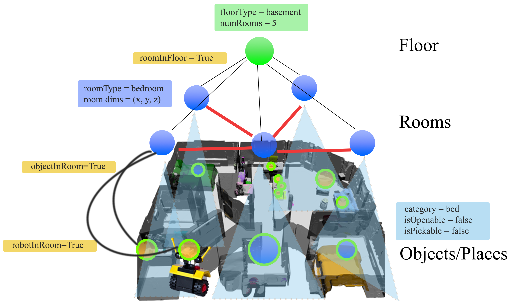
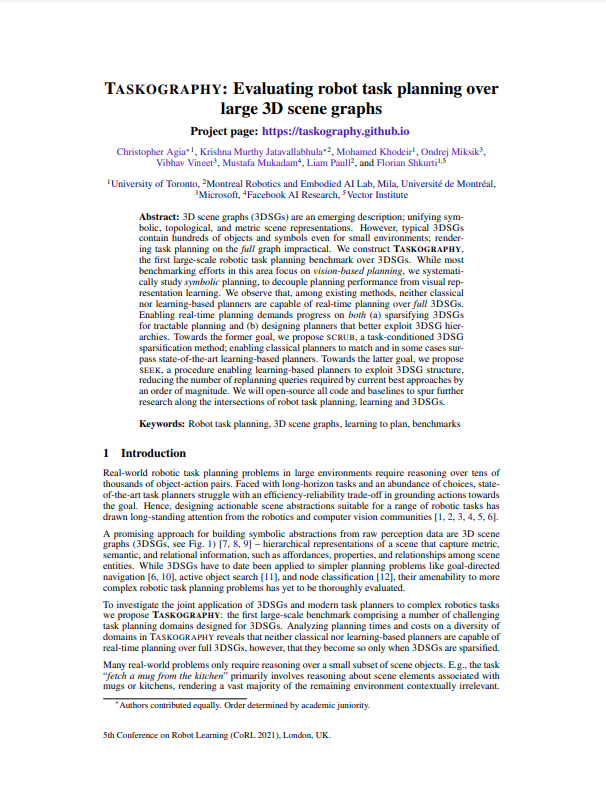
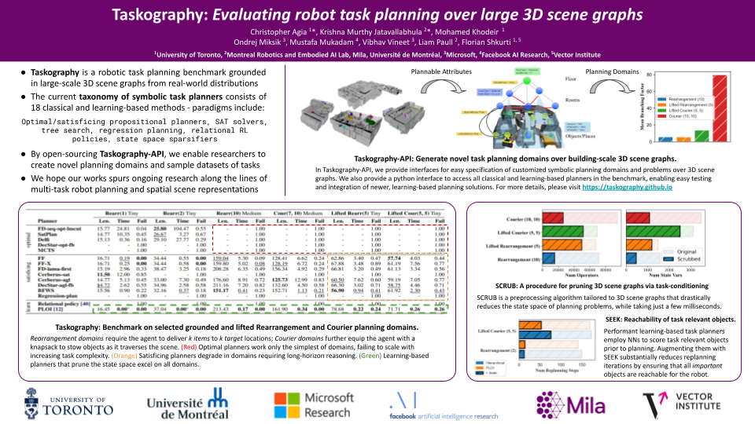
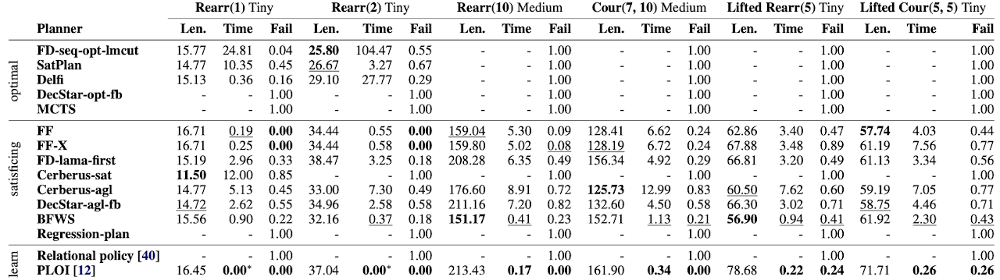

---
# Feel free to add content and custom Front Matter to this file.
# To modify the layout, see https://jekyllrb.com/docs/themes/#overriding-theme-defaults

permalink: /
title: Taskography - Evaluating robot task planning over large 3D scene graphs
layout: home
---

#### Conference on Robot Learning (CoRL) 2021


<!--  -->

<p align="center">
	<iframe width="560" height="315" src="https://www.youtube.com/embed/mM4v5hP4LdA" title="YouTube video player" frameborder="0" allow="accelerometer; autoplay; clipboard-write; encrypted-media; gyroscope; picture-in-picture" allowfullscreen></iframe>
</p>

3D scene graphs (**3DSG**s) [[1]](https://arxiv.org/abs/2002.06289),[[2]](https://3dscenegraph.stanford.edu/) are an emerging description; unifying symbolic, topological, and metric scene representations. However, typical 3DSGs contain hundreds of objects and symbols even for small environments; rendering task planning on the _full_ graph impractical. We construct **Taskography**, the first large-scale robotic task planning benchmark over 3DSGs. While most benchmarking efforts in this area focus on _vision-based planning_, we systematically study _symbolic_ planning, to decouple planning performance from visual representation learning. We observe that, among existing methods, neither classical nor learning-based planners are capable of real-time planning over _full_ 3DSGs. Enabling real-time planning demands progress on _both_ (a) sparsifying 3DSGs for tractable planning and (b) designing planners that better exploit 3DSG hierarchies. Towards the former goal, we propose **SCRUB**, a task-conditioned 3DSG sparsification method; enabling classical planners to match (and surpass) state-of-the-art learning-based planners. Towards the latter goal, we propose **SEEK**, a procedure enabling learning-based planners to exploit 3DSG structure, reducing the number of replanning queries required by current best approaches by an order of magnitude. We will open-source all code and baselines to spur further research along the intersections of robot task planning, learning and 3DSGs.


<figure>
	<p align="center">
	
	<figcaption><p align="center">A 3D scene graph (3DSG) annotated with plannable attributes.</p></figcaption>
	</p>
</figure>


### Quick links


<table>
	<tr>
	    <td>
	    	<div class="col-xs-15">
				<a href="https://openreview.net/pdf?id=nWLt35BU1z_">
					
				</a>
	        </div>
	    </td>
	    <td>
	        <div class="col-xs-15">
				<a href="assets/img/poster-preview.png">
					
				</a>
	        </div>
	    </td>
	    <td>
	        <div class="col-xs-15">
				<a href="https://github.com/taskography">
					
				</a>
	        </div>
	    </td>
	</tr>
	<tr>
		<td>
			<div class="people-name text-center">
            	<a href="https://openreview.net/pdf?id=nWLt35BU1z_">Paper</a>
            </div>
		</td>
		<td>
			<div class="people-name text-center">
            	<a href="assets/img/poster-preview.png">Poster</a>
            </div>
		</td>
		<td>
			<div class="people-name text-center">
            	<a href="https://github.com/taskography/taskography">Code / Data</a>
            </div>
		</td>
	</tr>
</table>


### Tasks

| **Rearrangement(k)** | **Courier(n, k)** | **Lifted Rearrangement(k)/Courier(n, k)** |
| ---------------------|-------------------|-------------------------------------------|
| Based on the recently proposed rearrangement challenge [71], this task requires a robot randomly spawned to rearrange a set of k objects of interest into k corre- sponding receptacles. The robot often needs to execute multiple other actions along the way, such as opening/closing doors, navigating to goals, planning the sequence of objects to visit, etc.| A robot that couriers objects is equipped with a knapsack of maximum payload capacity of n units. The robot needs to locate and courier k objects (of varying weights w ∈ {1, 2, 3} units) to k distinct delivery points. The knapsack can be used to stow and retrieve items in random-access fashion; effectively embedding a combinatorial optimization problem into the task. Stow and retrieve actions increase branching, necessitating far deeper searches. | We also provide lifted variants of these tasks. Here, goals are specified over desired object-receptacle class relations (e.g., “put a cup on a table”) as opposed to over object instances (e.g., “put this cup on the table”). These tasks introduce ambiguity in both the search of classical task-planners and learning-based techniques, which must now distinguish object instances of relevant classes. |


### Benchmark

<figure>
	<p align="center">
	
	<figcaption><p align="center">TASKOGRAPHY benchmark results on select grounded and lifted Rearrangement (Rearr) and Courier (Cour) 3DSG domains. Planning times are reported in seconds and do not incorporate planner-specific domain translation times (factored into planning timeouts). A ‘-’ indicates planning timeouts or failures (10 minutes for optimal planners, 30 seconds for all others). Results are aggregated over 10 random seeds - see supplementary for standard deviations and results across all 40 domains. Optimal task planning is infeasible in larger prob- lem instances or for more complex domains, while most satisficing planners are unable to achieve real-time performance. PLOI, a recent learning-based planner consistently performs the best across all domains.</p></figcaption>
	</p>
</figure>


### Citation

```
@inproceedings{agia2022taskography,
  title={Taskography: Evaluating robot task planning over large 3D scene graphs},
  author={Agia, Christopher and Jatavallabhula, {Krishna Murthy} and Khodeir, Mohamed and Miksik, Ondrej and Vineet, Vibhav and Mukadam, Mustafa and Paull, Liam and Shkurti, Florian},
  booktitle={Conference on Robot Learning},
  pages={46--58},
  year={2022},
  organization={PMLR}
}
```

<>